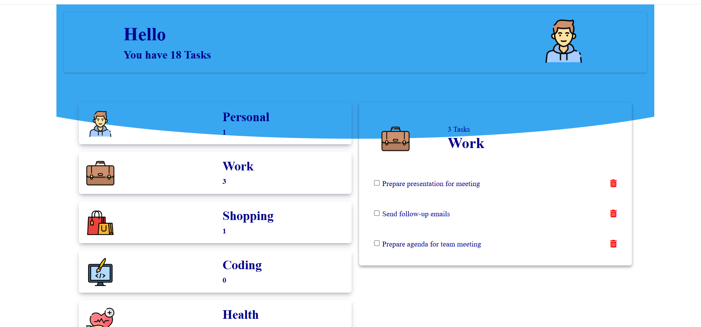

# ToDoListJs
## Description
This project is an advanced To-Do List application built using JavaScript and Object-Oriented Programming (OOP) principles. It allows users to organize their tasks into different categories, sort tasks, add new categories, and interact with the app. The application is pre-filled with default data on the first render, but it continues to update and respond to user activities, ensuring a smooth and dynamic user experience.
### Technologies Used

- HTML
- CSS
- JavaScript
- Object-Oriented Programming (OOP)

